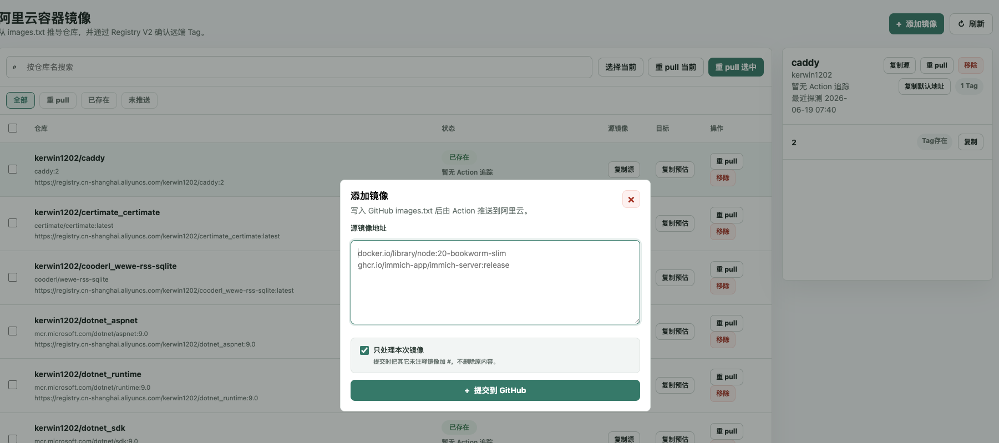

# Docker Images Pusher

使用 GitHub Actions 将 DockerHub、gcr.io、k8s.io、ghcr.io 等国外镜像转存到阿里云个人版 ACR，方便国内服务器拉取。

- 支持任意公开 Docker 镜像仓库。
- 支持最大 40GB 的大型镜像。
- 支持 `--platform` 指定镜像架构。
- 支持网页管理 `images.txt`，并查看阿里云 ACR 仓库和 Tag 状态。

原项目视频教程：https://www.bilibili.com/video/BV1Zn4y19743/

原作者：**[技术爬爬虾](https://github.com/tech-shrimp/me)**  
B 站、抖音、Youtube 全网同名，转载请注明作者。

## 仓库结构

- `images.txt`：要同步的镜像列表。
- `.github/workflows/docker.yaml`：读取 `images.txt`，拉取源镜像并推送到阿里云 ACR。
- `AcrMirrorManager/`：内置的 .NET 9 Razor Pages 管理页面。
- `doc/`：使用说明图片和管理页面截图。



## 工作流程

1. 在 `images.txt` 手动添加镜像，或在 ACR Mirror Manager 页面提交镜像。
2. `images.txt` 变更后，GitHub Actions 自动运行。
3. workflow 拉取源镜像，按规则生成阿里云 ACR 仓库名。
4. workflow 将镜像推送到阿里云 ACR。
5. 管理页面通过 Registry V2 API 检查仓库和 Tag 是否已经存在。

为了避免修改管理页面代码时也触发镜像同步，workflow 的 push 触发已经限制为只监听 `images.txt`。

## 配置阿里云

登录阿里云容器镜像服务：

https://cr.console.aliyun.com/

启用个人实例，创建一个命名空间，也就是后面要用的 `ALIYUN_NAME_SPACE`。


进入访问凭证页面，获取下面三个值：

- `ALIYUN_REGISTRY_USER`：用户名。
- `ALIYUN_REGISTRY_PASSWORD`：密码。
- `ALIYUN_REGISTRY`：仓库地址。


## 配置 GitHub Actions

Fork 本仓库后，进入自己的仓库，点击 Actions，启用 GitHub Actions 功能。

进入 `Settings` -> `Secrets and variables` -> `Actions` -> `New repository secret`，添加下面四个 Secret：

- `ALIYUN_NAME_SPACE`
- `ALIYUN_REGISTRY_USER`
- `ALIYUN_REGISTRY_PASSWORD`
- `ALIYUN_REGISTRY`


## 添加镜像

可以直接编辑根目录 `images.txt`：

- 可以写 tag，不写 tag 时默认使用 `latest`。
- 可以用 `--platform=linux/arm64` 或 `--platform linux/arm64` 指定架构。
- 可以用 `k8s.gcr.io/kube-state-metrics/kube-state-metrics` 这种格式指定私有路径。
- 可以用 `#` 注释暂时不处理的镜像。


示例：

```text
nginx
docker.io/library/node:20-bookworm-slim
--platform=linux/arm64 xiaoyaliu/alist
# ghcr.io/home-assistant/home-assistant:stable
```

提交 `images.txt` 后，GitHub Actions 会自动同步镜像。

## 使用同步后的镜像

回到阿里云容器镜像服务，进入镜像仓库，点击任意镜像可以查看镜像状态。仓库可以改成公开，公开后拉取镜像不需要登录。


国内服务器拉取示例：

```bash
docker pull registry.cn-hangzhou.aliyuncs.com/shrimp-images/alpine
```

其中：

- `registry.cn-hangzhou.aliyuncs.com` 是 `ALIYUN_REGISTRY`。
- `shrimp-images` 是 `ALIYUN_NAME_SPACE`。
- `alpine` 是同步后的仓库名。

## ACR Mirror Manager

ACR Mirror Manager 是内置的网页管理页面，代码在 `AcrMirrorManager/`。它本身不拉取镜像、不推送镜像，也不依赖本机 Docker daemon；页面只负责更新当前 GitHub 仓库根目录的 `images.txt`，真正同步仍由 GitHub Actions 完成。

主要功能：

- 在网页提交一个或多个源镜像，自动写入 `images.txt`。
- 支持“只处理本次镜像”：提交时把其它未注释镜像加 `#`。
- 支持重 pull 已有镜像，让 GitHub Actions 重新处理选中的源镜像。
- 支持从 `images.txt` 移除源镜像，并同步更新本地缓存。
- 通过 Docker Registry HTTP API V2 查询阿里云 ACR 仓库和 Tag。
- 展示镜像状态、Tag、Digest、源镜像地址和目标镜像地址。
- 使用本地缓存记录仓库、Tag、Action 追踪和待刷新任务。

## 管理页面配置

进入管理页面目录，复制配置模板：

```bash
cd AcrMirrorManager
cp .env.example .env
```

部署原仓库时只需要改下面这些字段：

```env
RegistryV2__Registry=registry.cn-shanghai.aliyuncs.com
RegistryV2__Namespace=你的阿里云命名空间
RegistryV2__Username=你的阿里云镜像仓库登录用户名
RegistryV2__Password=你的阿里云镜像仓库登录密码
GitHubMirror__Token=github_pat_xxx
```

如果部署的是 fork 仓库，再把 `GitHubMirror__RepositoryUrl` 改成自己的 fork 地址：

```env
GitHubMirror__RepositoryUrl=https://github.com/你的账号/docker_image_pusher
```

这个配置仍然需要存在，因为管理页面要通过 GitHub API 读写这个仓库的 `images.txt`。它现在指向的是合并后的同一个仓库，不再是另一个配套项目。

`GitHubMirror__Token` 用于读写 `images.txt`。如果使用 GitHub fine-grained token，建议授予：

- Repository access：当前 `docker_image_pusher` 仓库，或你 fork 后的仓库。
- Contents：Read and write。
- Actions：Read。

默认不需要 Actions 写权限，因为 `images.txt` 变更会自动触发 workflow。

## Docker 部署管理页面

在 `AcrMirrorManager/` 目录启动：

```bash
docker-compose up -d --build
```

默认访问地址：

```text
http://localhost:15187
```

常用命令：

```bash
docker-compose logs -f
docker-compose down
docker-compose down -v
```

可以在 `.env` 里修改宿主机端口：

```env
APP_HTTP_PORT=15187
```

Dockerfile 默认使用微软官方 .NET 镜像，也可以用私有基础镜像覆盖：

```env
SDK_IMAGE=mcr.microsoft.com/dotnet/sdk:9.0
ASPNET_IMAGE=mcr.microsoft.com/dotnet/aspnet:9.0
```

## 本地开发管理页面

```bash
cd AcrMirrorManager
dotnet run --project AcrMirrorManager.csproj
```

本地 `dotnet run` 不会自动读取 Docker 用的 `.env`。可以先导入当前 shell：

```bash
set -a
source .env
set +a
dotnet run --project AcrMirrorManager.csproj
```

也可以使用 `dotnet user-secrets`：

```bash
dotnet user-secrets set "RegistryBackend:Mode" "RegistryV2" --project AcrMirrorManager.csproj
dotnet user-secrets set "RegistryV2:Registry" "registry.cn-shanghai.aliyuncs.com" --project AcrMirrorManager.csproj
dotnet user-secrets set "RegistryV2:Namespace" "你的阿里云命名空间" --project AcrMirrorManager.csproj
dotnet user-secrets set "RegistryV2:Username" "你的阿里云镜像仓库登录用户名" --project AcrMirrorManager.csproj
dotnet user-secrets set "RegistryV2:Password" "你的阿里云镜像仓库登录密码" --project AcrMirrorManager.csproj
dotnet user-secrets set "GitHubMirror:RepositoryUrl" "https://github.com/你的账号/docker_image_pusher" --project AcrMirrorManager.csproj
dotnet user-secrets set "GitHubMirror:Token" "github_pat_xxx" --project AcrMirrorManager.csproj
```

## GitLab CI 部署管理页面

仓库根目录包含 `.gitlab-ci.yml`，这是个人 Windows 本地 runner 部署示例。GitLab 默认只识别仓库根目录的 `.gitlab-ci.yml`，所以它不能放在 `AcrMirrorManager/` 子目录。

当前 CI 约定：

- runner tag：`local_168`
- 只部署 `main` 分支
- 部署目录：`D:\stocks\docker_image_pusher`
- 首次运行时目录不存在会自动 clone 整个仓库
- 后续运行会 fetch 并 reset 到当前 CI commit
- 进入 `AcrMirrorManager` 子目录后执行 `docker-compose up -d --build`

推荐在 GitLab CI/CD Variables 里新增一个 File 类型变量：

```text
Key: ACR_MIRROR_ENV_FILE
Type: File
Value: 完整 .env 文件内容
```

CI 会把这个文件复制到：

```text
D:\stocks\docker_image_pusher\AcrMirrorManager\.env
```

如果不配置 `ACR_MIRROR_ENV_FILE`，也可以手动在部署机维护这个 `.env` 文件。

## 镜像命名规则

workflow 和管理页面使用同一套命名规则：

- 去掉 registry host，例如 `docker.io/library/node:20` -> `library_node`。
- 去掉 tag，只把 tag 用于最终目标镜像地址。
- 路径中的 `/` 替换为 `_`。
- 如果包含 `--platform=linux/arm64` 或 `--platform linux/arm64`，仓库名追加 `_linux_arm64`。

示例：

```text
docker.io/library/node:20-bookworm-slim -> library_node:20-bookworm-slim
ghcr.io/immich-app/immich-server:release -> immich-app_immich-server:release
--platform=linux/arm64 xiaoyaliu/alist -> xiaoyaliu_alist_linux_arm64:latest
```

多架构镜像需要在 `images.txt` 中手动指定架构。


如果不同命名空间下存在同名镜像，会把命名空间作为前缀加到镜像名称中。

```text
xhofe/alist
xiaoyaliu/alist
```


## 定时执行

如果需要定时同步，可以修改 `.github/workflows/docker.yaml`，添加 `schedule`。cron 使用 UTC 时区。


## 管理页面缓存

- 缓存文件默认在 `AcrMirrorManager/App_Data/registry-v2-cache.json`。
- Docker 部署时该路径挂载到 `acrmirror-data` volume。
- 页面普通打开优先读缓存，避免每次都请求远端 Registry。
- 如果缓存为空，页面会自动读取 GitHub `images.txt`，反推仓库列表并探测 Registry V2。
- 顶部刷新按钮会强制重新探测。
- 后台任务每分钟检查待刷新任务。
- `RegistryV2:DailyMissingRefreshHour` 控制每天几点刷新 `未推送` 仓库。
- `RegistryV2:PostSubmitRefreshMinutes` 控制提交新镜像后延迟探测的分钟列表，默认 `[3, 5, 10, 20]`。

## 安全

- 不要提交真实 token、密码、AK/SK。
- `AcrMirrorManager/.env` 已被忽略，不应提交。
- `AcrMirrorManager/Dockerfile` 不复制 `.env`，不会把密钥写进镜像层。
- 管理页面可以更新 GitHub 仓库并查看 ACR 状态，建议只部署在可信网络内，或放在登录、IP 白名单、Cloudflare Access、Tailscale、反向代理 Basic Auth 后面。
