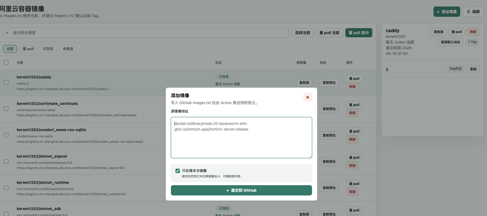

# Docker Images Pusher

使用 GitHub Actions 将 DockerHub、gcr.io、k8s.io、ghcr.io 等国外镜像转存到阿里云个人版 ACR，方便国内服务器拉取。

- 支持任意公开 Docker 镜像仓库。
- workflow 会清理 GitHub Runner 中的非必要组件，为较大镜像释放更多磁盘空间；实际可用空间以当次 Runner 为准。
- 支持 `--platform` 指定镜像架构。
- 支持网页管理普通和定时镜像列表，并查看阿里云 ACR 仓库和 Tag 状态。

原项目视频教程：https://www.bilibili.com/video/BV1Zn4y19743/

原作者：**[技术爬爬虾](https://github.com/tech-shrimp/me)**  
B 站、抖音、Youtube 全网同名，转载请注明作者。

## 仓库结构

- `images.txt`：要同步的镜像列表。
- `scheduled-images.txt`：只保存需要定时重新 pull 的镜像。
- `.github/workflows/docker.yaml`：按触发类型读取普通或定时镜像列表，拉取源镜像并推送到阿里云 ACR。
- `AcrMirrorManager/`：内置的 .NET 9 Razor Pages 管理页面。
- `doc/`：使用说明图片和管理页面截图。



## 工作流程

1. 在 `images.txt` 手动添加镜像，或在 ACR Mirror Manager 页面提交镜像。
2. `main` 分支的 `images.txt` 变更后，GitHub Actions 自动运行；到达定时时间时则只读取 `scheduled-images.txt`。
3. workflow 拉取源镜像，按规则生成阿里云 ACR 仓库名。
4. workflow 将镜像推送到阿里云 ACR。
5. 默认的管理页面根据 `images.txt` 推导应有仓库，再通过 Registry V2 API 检查这些仓库和 Tag 是否存在。

为了避免修改管理页面代码或定时名单时立即触发普通同步，workflow 的 push 触发只监听 `main` 分支的 `images.txt`。在 GitHub Actions 页面手动运行 `workflow_dispatch` 时，也会处理 `images.txt` 中当前所有未注释镜像。

## 配置阿里云

登录阿里云容器镜像服务：

https://cr.console.aliyun.com/

启用个人实例，创建一个命名空间，也就是后面要用的 `ALIYUN_NAME_SPACE`。


进入访问凭证页面，获取下面三个值：

- `ALIYUN_REGISTRY_USER`：用户名。
- `ALIYUN_REGISTRY_PASSWORD`：密码。
- `ALIYUN_REGISTRY`：仓库地址。


## 配置 GitHub Actions

Fork 本仓库后，进入自己的仓库，点击 Actions，启用 GitHub Actions 功能。

进入 `Settings` -> `Secrets and variables` -> `Actions` -> `New repository secret`，添加下面四个 Secret：

- `ALIYUN_NAME_SPACE`
- `ALIYUN_REGISTRY_USER`
- `ALIYUN_REGISTRY_PASSWORD`
- `ALIYUN_REGISTRY`


## 添加镜像

可以直接编辑根目录 `images.txt`：

- 可以写 tag，不写 tag 时默认使用 `latest`。
- 可以使用 `image@sha256:...` 固定源镜像 digest；没有显式 tag 时，目标 Tag 使用 `latest`。
- 可以用 `--platform=linux/arm64` 或 `--platform linux/arm64` 指定架构。
- 可以用 `k8s.gcr.io/kube-state-metrics/kube-state-metrics` 这种格式指定带 registry host 的多级仓库路径。
- 可以用 `#` 注释暂时不处理的整行镜像；不支持在镜像地址后追加行尾注释。
- registry host 如果带端口，建议始终写出明确 tag，例如 `registry.example.com:5000/team/app:latest`。

workflow 只执行公开可拉取的源镜像，目前没有配置源仓库登录凭证的功能。

`nginx` 这类短名称可以被 workflow 正常拉取；为了让管理页面在缓存重建后也能稳定识别，推荐写成 `nginx:latest` 或完整的 `docker.io/library/nginx:latest`。


示例：

```text
nginx
docker.io/library/node:20-bookworm-slim
--platform=linux/arm64 xiaoyaliu/alist
# ghcr.io/home-assistant/home-assistant:stable
```

提交 `images.txt` 后，GitHub Actions 会自动同步镜像。

## 使用同步后的镜像

回到阿里云容器镜像服务，进入镜像仓库，点击任意镜像可以查看镜像状态。仓库可以改成公开，公开后拉取镜像不需要登录。


国内服务器拉取示例：

```bash
docker pull registry.cn-hangzhou.aliyuncs.com/shrimp-images/alpine
```

其中：

- `registry.cn-hangzhou.aliyuncs.com` 是 `ALIYUN_REGISTRY`。
- `shrimp-images` 是 `ALIYUN_NAME_SPACE`。
- `alpine` 是同步后的仓库名。

## ACR Mirror Manager

ACR Mirror Manager 是内置的网页管理页面，代码在 `AcrMirrorManager/`。它本身不拉取镜像、不推送镜像，也不依赖本机 Docker daemon；页面负责通过 GitHub API 管理 `images.txt` 和 `scheduled-images.txt`，真正的镜像同步仍由 GitHub Actions 完成。

主要功能：

- 在网页提交一个或多个源镜像，自动写入 `images.txt`。
- 支持“只处理本次镜像”：提交时把其它未注释镜像加 `#`。
- 支持重 pull 已有镜像，让 GitHub Actions 重新处理选中的源镜像。
- 支持单个或批量把指定镜像加入 GitHub Actions 定时重新 pull 列表。
- 支持取消定时，并按“已定时”筛选镜像。
- 支持从页面移除源镜像：立即清除本地展示和定时名单，并在下次提交或重 pull 时从 `images.txt` 一并删除。
- 通过 Docker Registry HTTP API V2 查询由 `images.txt` 推导出的阿里云 ACR 仓库和 Tag，不会枚举命名空间下与本项目无关的全部仓库。
- 展示镜像状态、Tag、Digest、源镜像地址和目标镜像地址。
- 支持“复制源镜像”“复制目标镜像”，也可以复制两行 `docker pull` + `docker tag` 命令，把目标镜像拉到本机后标记回源镜像名称；每个 Tag 都支持复制对应版本的地址和命令。
- 使用本地缓存记录仓库、Tag、Action 追踪和待刷新任务。

默认 `RegistryBackend__Mode=RegistryV2` 只提供查询和状态展示，不支持从页面删除远端 ACR Tag 或仓库。只有旧的 `AliyunApi` 模式实现了远端删除，但该模式配置更复杂，也不适用于阿里云 ACR 个人版的默认部署。

## 管理页面配置

进入管理页面目录，复制配置模板：

```bash
cd AcrMirrorManager
cp .env.example .env
```

部署原仓库时只需要改下面这些字段：

```env
RegistryV2__Registry=registry.cn-shanghai.aliyuncs.com
RegistryV2__Namespace=你的阿里云命名空间
RegistryV2__Username=你的阿里云镜像仓库登录用户名
RegistryV2__Password=你的阿里云镜像仓库登录密码
GitHubMirror__Token=github_pat_xxx
```

如果部署的是 fork 仓库，再把 `GitHubMirror__RepositoryUrl` 改成自己的 fork 地址：

```env
GitHubMirror__RepositoryUrl=https://github.com/你的账号/docker_image_pusher
```

这个配置仍然需要存在，因为管理页面要通过 GitHub API 读写这个仓库的 `images.txt` 和 `scheduled-images.txt`。它现在指向的是合并后的同一个仓库，不再是另一个配套项目。

`GitHubMirror__Branch` 和 `GitHubMirror__ImagesPath` 默认分别是 `main`、`images.txt`。如果修改，也必须同步修改 workflow 的 `push.branches`、`push.paths` 和实际读取文件，否则页面提交后不会按预期触发。

`GitHubMirror__ScheduledImagesPath` 默认是 `scheduled-images.txt`。如果修改这个路径，还必须同步修改 `.github/workflows/docker.yaml` 中定时任务读取的文件名，否则页面和 workflow 会操作不同文件。

管理页面的 `RegistryV2__Registry`、`RegistryV2__Namespace` 必须和 GitHub Actions 中的 `ALIYUN_REGISTRY`、`ALIYUN_NAME_SPACE` 指向同一套 ACR，否则 Action 推送成功后，页面会探测到另一个地址。

`GitHubMirror__Token` 用于读写 `images.txt` 和 `scheduled-images.txt`。如果使用 GitHub fine-grained token，建议授予：

- Repository access：当前 `docker_image_pusher` 仓库，或你 fork 后的仓库。
- Contents：Read and write。
- Actions：Read。

`Contents: Read and write` 是页面增删普通、定时镜像所必需的权限；`Actions: Read` 用于页面追踪手动提交对应的 workflow 状态。默认不需要 Actions 写权限，因为 `images.txt` 变更会自动触发 workflow。

## Docker 部署管理页面

在 `AcrMirrorManager/` 目录启动：

```bash
docker-compose up -d --build
```

默认访问地址：

```text
http://localhost:15187
```

常用命令：

```bash
docker-compose logs -f
docker-compose down
docker-compose down -v
```

`docker-compose down -v` 会同时删除 `acrmirror-data` volume，其中包含管理页面缓存和待处理的 `images.txt` 移除记录。只想停止服务时请使用 `docker-compose down`，不要加 `-v`。

定时名单保存在 GitHub 的 `scheduled-images.txt`，不在 Docker volume 中，因此删除 volume 不会取消已经配置的定时任务。

可以在 `.env` 里修改宿主机端口：

```env
APP_HTTP_PORT=15187
```

Dockerfile 默认使用微软官方 .NET 镜像，也可以用私有基础镜像覆盖：

```env
SDK_IMAGE=mcr.microsoft.com/dotnet/sdk:9.0
ASPNET_IMAGE=mcr.microsoft.com/dotnet/aspnet:9.0
```

## 本地开发管理页面

```bash
cd AcrMirrorManager
dotnet run --project AcrMirrorManager.csproj
```

本地 `dotnet run` 不会自动读取 Docker 用的 `.env`。如果 `.env` 中的值已经按 shell 语法正确引用，可以先导入当前 shell：

```bash
set -a
source .env
set +a
dotnet run --project AcrMirrorManager.csproj
```

密码或 token 中如果包含 `&`、空格、引号等 shell 特殊字符，直接 `source .env` 可能解析失败。此时推荐使用下面的 `dotnet user-secrets`，或在 `.env` 中按当前 shell 的语法为值加引号；Docker Compose 读取 `.env` 不要求使用 shell 的 `source` 语法。

也可以使用 `dotnet user-secrets`：

```bash
dotnet user-secrets set "RegistryBackend:Mode" "RegistryV2" --project AcrMirrorManager.csproj
dotnet user-secrets set "RegistryV2:Registry" "registry.cn-shanghai.aliyuncs.com" --project AcrMirrorManager.csproj
dotnet user-secrets set "RegistryV2:Namespace" "你的阿里云命名空间" --project AcrMirrorManager.csproj
dotnet user-secrets set "RegistryV2:Username" "你的阿里云镜像仓库登录用户名" --project AcrMirrorManager.csproj
dotnet user-secrets set "RegistryV2:Password" "你的阿里云镜像仓库登录密码" --project AcrMirrorManager.csproj
dotnet user-secrets set "GitHubMirror:RepositoryUrl" "https://github.com/你的账号/docker_image_pusher" --project AcrMirrorManager.csproj
dotnet user-secrets set "GitHubMirror:Token" "github_pat_xxx" --project AcrMirrorManager.csproj
```

## GitLab CI 部署管理页面

仓库根目录包含 `.gitlab-ci.yml`，这是个人 Windows 本地 runner 部署示例。GitLab 默认只识别仓库根目录的 `.gitlab-ci.yml`，所以它不能放在 `AcrMirrorManager/` 子目录。

当前 CI 约定：

- runner tag：`local_168`
- 只部署 `main` 分支
- 部署目录：`D:\stocks\docker_image_pusher`
- 首次运行时目录不存在会自动 clone 整个仓库
- 后续运行会 fetch 并 reset 到当前 CI commit
- 进入 `AcrMirrorManager` 子目录后执行 `docker-compose up -d --build`

当前 `.gitlab-ci.yml` 把 `SDK_IMAGE` 和 `ASPNET_IMAGE` 默认设置成 `registry.cn-shanghai.aliyuncs.com/kerwin1202/...` 下的项目特定示例镜像。其它环境应改成自己可拉取的基础镜像，或删除这两个 CI 变量以使用 Dockerfile 中的微软官方默认镜像。

推荐在 GitLab CI/CD Variables 里新增一个 File 类型变量：

```text
Key: ACR_MIRROR_ENV_FILE
Type: File
Value: 完整 .env 文件内容
```

CI 会把这个文件复制到：

```text
D:\stocks\docker_image_pusher\AcrMirrorManager\.env
```

如果不配置 `ACR_MIRROR_ENV_FILE`，也可以手动在部署机维护这个 `.env` 文件。

## 镜像命名规则

workflow 和管理页面使用同一套命名规则：

- 去掉 registry host，例如 `docker.io/library/node:20` -> `library_node`。
- 去掉 tag，只把 tag 用于最终目标镜像地址。
- 路径中的 `/` 替换为 `_`。
- 如果包含 `--platform=linux/arm64` 或 `--platform linux/arm64`，仓库名追加 `_linux_arm64`。
- digest 只用于固定源镜像内容，不进入目标仓库名；没有显式 tag 时目标 Tag 为 `latest`。

示例：

```text
docker.io/library/node:20-bookworm-slim -> library_node:20-bookworm-slim
ghcr.io/immich-app/immich-server:release -> immich-app_immich-server:release
--platform=linux/arm64 xiaoyaliu/alist -> xiaoyaliu_alist_linux_arm64:latest
```

workflow 不会为同一个目标 Tag 创建多架构 manifest。需要指定非默认架构时，应在 `images.txt` 中写 `--platform`；不同架构会写入带 `_linux_arm64` 等后缀的不同 ACR 仓库。


如果不同命名空间下存在同名镜像，会把命名空间作为前缀加到镜像名称中。

```text
xhofe/alist
xiaoyaliu/alist
```


## 定时执行

定时重新 pull 由 GitHub Actions 执行，不依赖 ACR Mirror Manager 容器一直在线。

### 普通 pull 与定时 pull

| 操作 | 使用的文件 | 何时执行 |
| --- | --- | --- |
| 添加镜像、手动重 pull | `images.txt` | 文件提交后立即触发 |
| 加入或取消定时 | `scheduled-images.txt` | 只更新定时名单，不立即 pull |
| GitHub 定时任务 | `scheduled-images.txt` | 到达 workflow 的 cron 时间后执行 |

两份文件互相独立。手动重 pull 对 `images.txt` 中其它行的注释处理，不会修改 `scheduled-images.txt`。

### 在管理页面设置定时

1. 打开管理页面，在镜像所在行点击“加入定时”；也可以先勾选多个镜像，再点击“选中加入定时”。
2. 批量加入时，页面会把所有选中的源镜像一次性写入 `scheduled-images.txt`，只产生一个 GitHub Commit；已经存在的镜像会自动跳过。
3. GitHub Actions 到达定时时间后只处理这个文件中的镜像，不会重新 pull `images.txt` 中的全部镜像。
4. 可以使用页面上的“已定时”筛选快速查看定时名单。
5. 点击“取消定时”，或从管理页面移除镜像，会同时把它移出定时列表。

也可以直接编辑 `scheduled-images.txt`。它与 `images.txt` 使用相同的镜像格式，支持 tag、digest 和 `--platform`；空行及以 `#` 开头的行不会执行。

### 执行时间

当前 `.github/workflows/docker.yaml` 默认每天 `23:00 UTC` 执行，也就是北京时间次日 `07:00` 左右。要修改频率，只需调整 workflow 中的 cron：

```yaml
schedule:
  - cron: '0 23 * * *'
```

cron 使用 UTC 时区，GitHub 的实际启动时间可能有少量延迟。当前所有定时镜像共用这一个执行频率，不支持为每个镜像分别设置不同时间。定时列表为空时，workflow 会跳过 Docker 初始化和镜像处理。

管理页面当前只展示镜像是否属于定时名单，不会把 cron 触发的 workflow 运行记录关联到某个页面提交。定时执行结果请在 GitHub Actions 中查看；执行完成后可在管理页面点击“刷新”重新探测 ACR 状态。

### 与手动重 pull 的关系

同一个镜像可以同时存在于 `images.txt` 和 `scheduled-images.txt`。如果手动重 pull 恰好接近定时时间，它可能被连续处理两次，但不会同时执行：workflow 使用统一的 `docker-mirror` concurrency group，同一时间只允许一个镜像同步任务运行。

目前没有“近期已经手动 pull 过就跳过本次定时”的时间窗口去重；因此靠得很近的两次触发可能造成一次重复拉取和推送，但不会并发写入同一个 ACR Tag。


## 管理页面缓存

- 缓存文件默认在 `AcrMirrorManager/App_Data/registry-v2-cache.json`。
- Docker 部署时该路径挂载到 `acrmirror-data` volume。
- 页面普通打开优先读缓存，避免每次都请求远端 Registry。
- 如果缓存为空，页面会读取 GitHub `images.txt`，根据配置决定是否包含已注释镜像，再反推本项目的仓库列表并探测 Registry V2。
- 顶部刷新按钮会强制重新探测。
- 后台任务每分钟检查由管理页面提交产生的 GitHub Action 追踪任务和待刷新任务。
- `RegistryV2:DailyMissingRefreshHour` 按管理服务的本地时区控制每天几点刷新 `未推送` 仓库；Docker 默认使用 `Asia/Shanghai`。
- `RegistryV2:PostSubmitRefreshMinutes` 控制提交新镜像后延迟探测的分钟列表，默认 `[3, 5, 10, 20]`。
- `RegistryV2:IncludeCommentedImages` 默认为 `true`，因此 `images.txt` 中被 `#` 注释的历史镜像仍会显示；改为 `false` 后只读取未注释行。

## 安全

- 不要提交真实 token、密码、AK/SK。
- `AcrMirrorManager/.env` 已被忽略，不应提交。
- `AcrMirrorManager/Dockerfile` 不复制 `.env`，不会把密钥写进镜像层。
- 管理页面自身没有内置登录认证，并且可以更新 GitHub 仓库、查看 ACR 状态。请只部署在可信网络内，或放在登录、IP 白名单、Cloudflare Access、Tailscale、反向代理 Basic Auth 后面。
